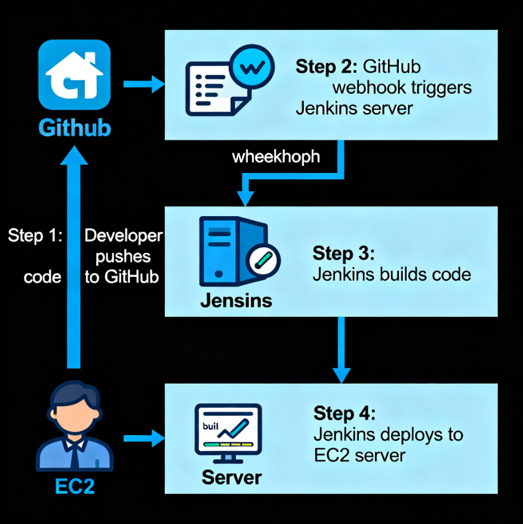
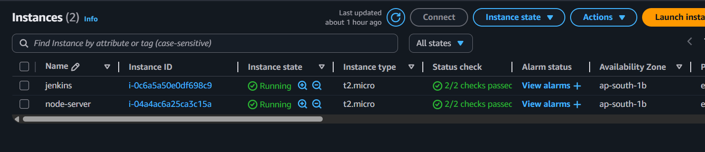
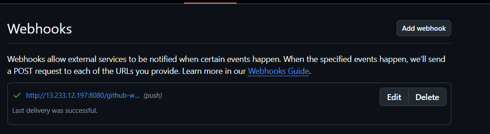
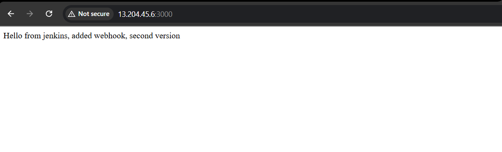

# 🚀 CI/CD Automation for Node.js Application using Jenkins and AWS EC2

This project demonstrates how to automate the deployment of a Node.js web application using **Jenkins**, **GitHub**, and **AWS EC2** instances.  
The setup ensures that whenever new code is pushed to GitHub, Jenkins automatically pulls, builds, and deploys it to the Node.js server — implementing a complete CI/CD pipeline.

---



## 🏗️ **Architecture Overview**

1. **Jenkins Server (EC2 Instance 1)**  
   - Jenkins is installed and configured.  
   - Manages the pipeline stages (build, test, deploy).  
   - Connected to GitHub via Webhook.

2. **Node.js Application Server (EC2 Instance 2)**  
   - Hosts the Node.js application.  
   - Jenkins connects over SSH to deploy the latest build.

3. **GitHub Repository**  
   - Stores the Node.js source code and `Jenkinsfile`.  
   - Webhook triggers Jenkins automatically after every commit or push.

---

## ⚙️ **Workflow Steps**

1. **Launch Jenkins Server on EC2**
   ```bash
   sudo apt update
   sudo apt install openjdk-17-jre -y
   wget -q -O - https://pkg.jenkins.io/debian-stable/jenkins.io.key | sudo apt-key add -
   sudo sh -c 'echo deb http://pkg.jenkins.io/debian-stable binary/ > /etc/apt/sources.list.d/jenkins.list'
   sudo apt update
   sudo apt install jenkins -y
   
2.   **Launch Node.js Server on EC2**

    sudo apt update
    sudo apt install nodejs npm -y
    node -v
    npm -v



3.  **Setup Jenkins**

- Install required plugins: Git, NodeJS, SSH Agent.

- Add credentials for SSH connection to the Node server.

- Configure Jenkins global tools for Node and Git.

4.  **Create Jenkinsfile**

    - Example pipeline stages:

    ```
    pipeline {
    agent any

    environment {
        SERVER_IP      = '172.31.4.47'
        SSH_CREDENTIAL = 'node-app-key'
        REPO_URL       = 'https://github.com/spandankolhe/nodejs-app-CICD.git'
        BRANCH         = 'main'
        REMOTE_USER    = 'ubuntu'
        REMOTE_PATH    = '/home/ubuntu/node-app'
    }

    stages {
        stage('Clone Repository') {
            steps {
                git branch: "${BRANCH}", url: "${REPO_URL}"
            }
        }

        stage('Upload Files to EC2') {
            steps {
                sshagent([SSH_CREDENTIAL]) {
                    sh """
                        ssh -o StrictHostKeyChecking=no ${REMOTE_USER}@${SERVER_IP} 'mkdir -p ${REMOTE_PATH}'
                        scp -o StrictHostKeyChecking=no -r * ${REMOTE_USER}@${SERVER_IP}:${REMOTE_PATH}/
                    """
                }
            }
        }

        stage('Install Dependencies & Start App') {
            steps {
                sshagent([SSH_CREDENTIAL]) {
                    sh """
                        ssh -o StrictHostKeyChecking=no ${REMOTE_USER}@${SERVER_IP} '
                            cd ${REMOTE_PATH} &&
                            npm install &&
                            pm2 start app.js --name node-app || pm2 restart node-app
                        '
                    """
                }
            }
        }
    }

    post {
        success {
            echo '✅ Application deployed successfully!'
        }
        failure {
            echo '❌ Deployment failed.'
        }
    }
}

5. **Setup GitHub Webhook**

- Go to your GitHub repo → Settings → Webhooks → Add webhook

- Payload URL: http://<jenkins-server-ip>:8080/github-webhook/

- Content type: application/json

- Select: “Just the push event”

- Save webhook ✅



6. **Test the Pipeline**

- Push new code to GitHub → Jenkins auto-triggers build → App updates automatically on Node.js EC2.


## 🧰 Tools & Technologies Used

- AWS EC2 (Jenkins + Node.js Servers)

- Jenkins

- Git & GitHub

- Node.js

- PM2 (for process management)

 - Shell scripting

- Webhooks

## 🧩 Project Highlights

- Automated end-to-end deployment pipeline.

- Real-time integration between GitHub and Jenkins using webhooks.

- Zero manual intervention after setup — fully CI/CD-enabled.

## 🏁 Conclusion



This project successfully demonstrates the implementation of a complete CI/CD pipeline using Jenkins and AWS EC2 for a Node.js application.
By integrating Jenkins with GitHub webhooks, every code change is automatically built, tested, and deployed to the application server — ensuring faster delivery, fewer errors, and improved reliability.

This setup replicates a real-world DevOps environment where automation and continuous integration play a key role in modern software development.
The project enhanced my understanding of Jenkins pipelines, GitHub automation, and deployment strategies on AWS — providing a solid foundation for future DevOps and cloud-based automation projects.
